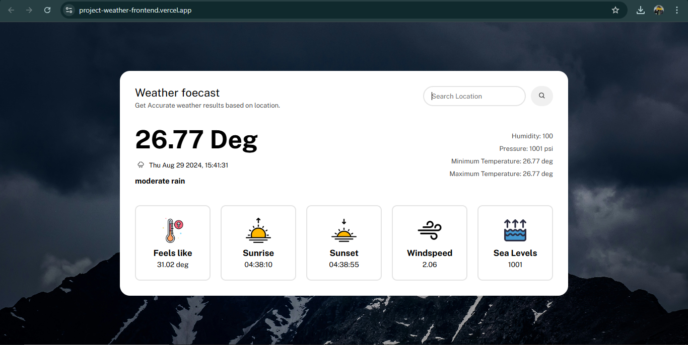
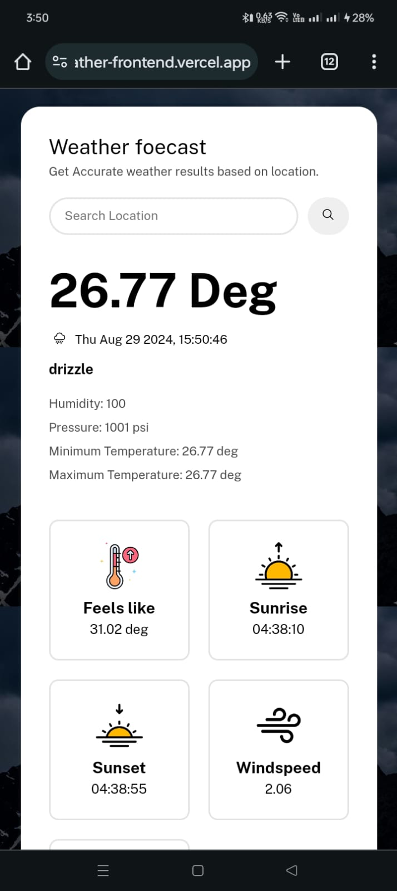

# Weather Forecasting Web App

This project is a weather forecasting web application that provides real-time weather information based on the user's location or a location entered by the user. The app is built using the MERN stack and follows an MVC-based architecture.

## Project Description

The Weather Forecasting Web App is a real-time weather information platform built using the MERN stack (MongoDB, Express, React, Node.js). It allows users to get current weather conditions for their location or any city they search for, displaying data such as temperature, humidity, wind speed, and a brief weather description.

The app uses the OpenWeatherMap API to fetch weather data and TomTom Maps API to retrieve latitude and longitude based on user searches. The frontend, developed with React, handles most of the data fetching and displays the results in a user-friendly, responsive interface that adapts to desktop, tablet, and mobile screens.

The backend, built with Express and Node.js, manages search history by generating a unique user ID with the `uuid.v4` module and storing it in MongoDB. This setup allows the app to save and analyze search patterns for improved user experience. The entire application is deployed on Vercel, with separate deployments for the frontend and backend components.

## Features
- Fetches weather data using the OpenWeatherMap API.
- Displays current weather conditions such as temperature, humidity, wind speed, and a brief description.
- Uses TomTom Maps API for fetching latitude and longitude based on the place searched.
- Responsive design compatible with desktop, tablet, and mobile devices.
- Caches user search history using a unique UID stored in MongoDB for better analysis and usage.
- Error handling for invalid city names or API errors.
- Frontend handles most operations, including fetching weather and location data.
- Deployed on Vercel with separate deployments for the frontend (React) and backend (Express server).

## Tech Stack
- **Frontend:** React, CSS (for responsive design)
- **Backend:** Node.js, Express.js
- **Database:** MongoDB
- **APIs:** OpenWeatherMap API, TomTom Maps API
- **Deployment:** Vercel

## Architecture
The app uses a MERN stack with the frontend built in React and the backend in Express.js. The frontend handles fetching weather data and managing the user interface, while the backend manages search history and user tokens stored in MongoDB.

### Frontend
- [Frontend GitHub Repository](https://github.com/wrench141/project-weather-frontend.git)
- [Frontend Deployed Link](https://project-weather-frontend.vercel.app/)

### Backend
- [Backend GitHub Repository](https://github.com/wrench141/project-weather.git)
- [API Deployed Link](https://project-weather-sand.vercel.app)

## Screenshots

### Desktop View

### Mobile View
